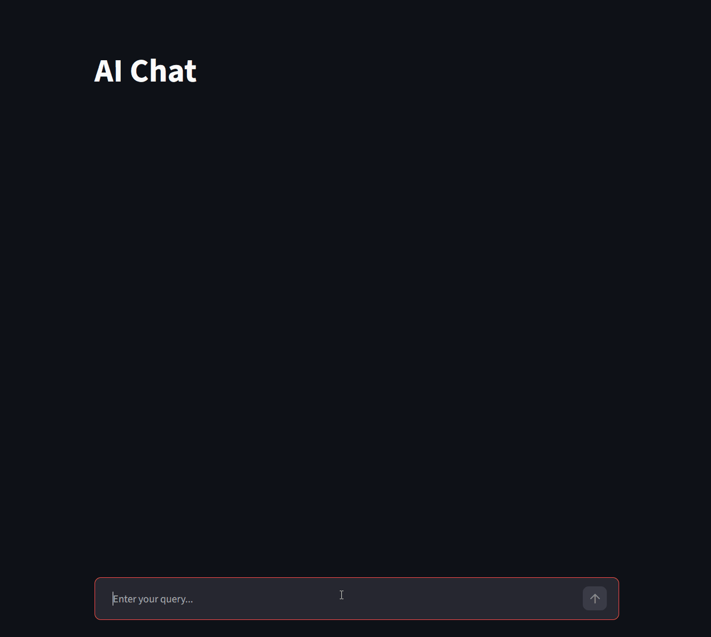
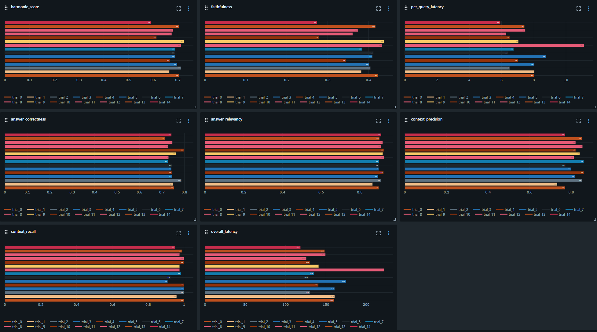
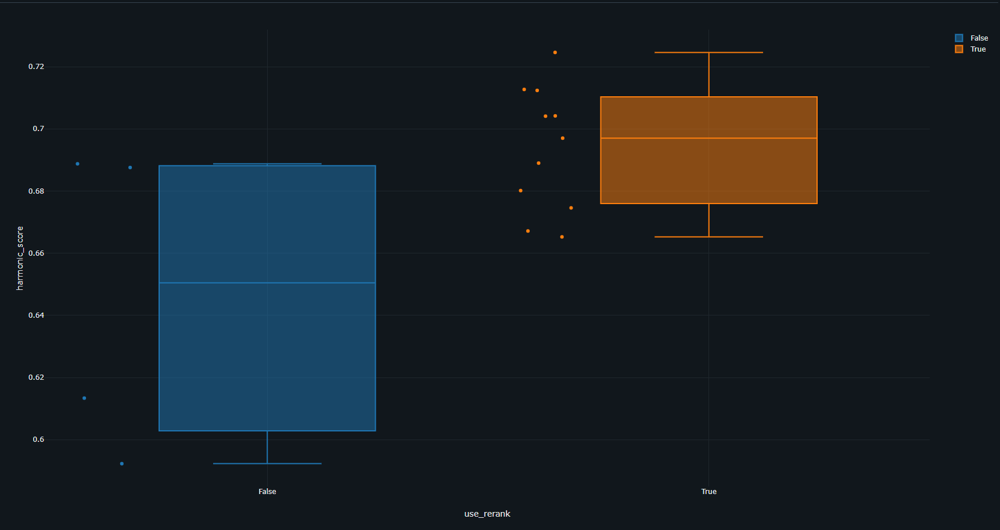
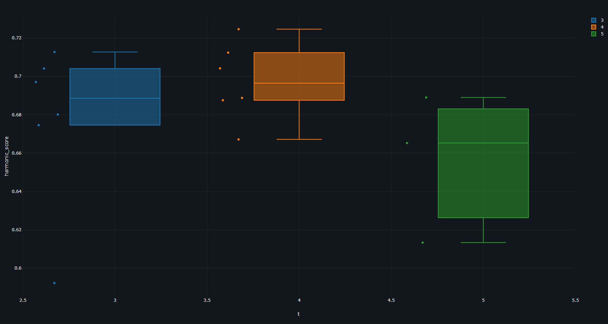
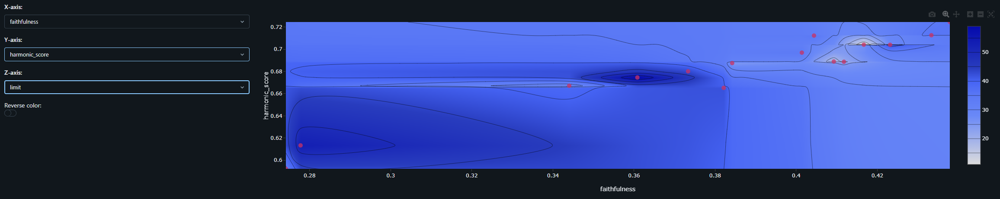
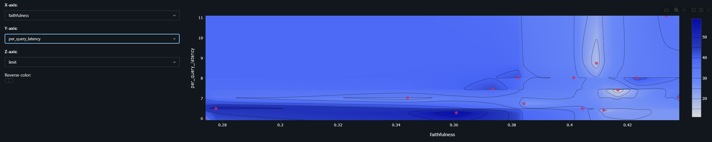
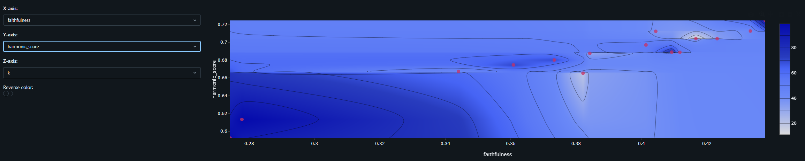
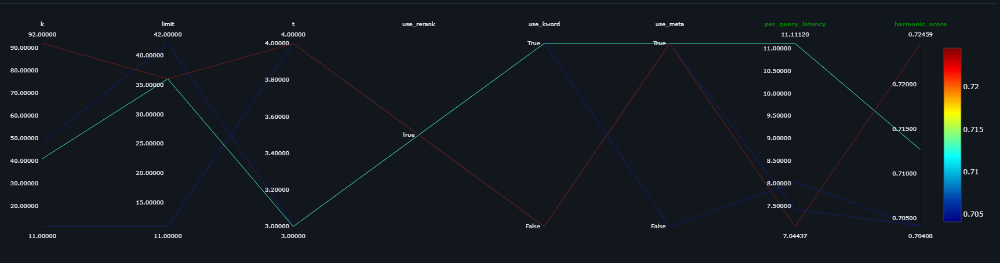
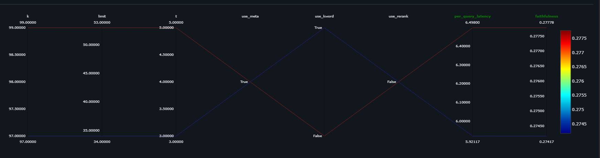
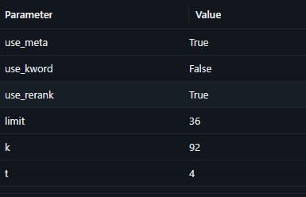

# RAG System: Hybrid Search & Asynchronous LLM API

A scalable asynchronous microservice for Retrieval-Augmented Generation (RAG). The project implements a robust retrieval pipeline (Hybrid Search + Reranking) and provides a REST API built with FastAPI. The RAG system focuses primarily on "mathematics" and "machine learning" topics, utilizing data scraped from open sources: https://www.geeksforgeeks.org/. Both the textual data and the embedding vectors are stored in PostgreSQL using the `pgvector` and `pg_trgm` extensions.


## Key Features

1. **Ingestion & Preprocessing**: Document parsing, semantic chunking with a strict 400-token limit, vectorization, and ingestion into the vector database.
2. **Retrieval (SLM)**: Query processing using a compact SLM to extract topics/subtopics. 
3. **Hybrid Search**: A combination of lexical and semantic (Dense Vector) search, aggregated via Reciprocal Rank Fusion (RRF).
4. **Cross-Encoder Reranking**: Re-evaluating candidate relevance using the `ms-marco-MiniLM-L-6-v2` cross-encoder, followed by chunk reordering (Lost in the Middle Mitigation) to optimize the LLM's attention distribution.
5. **Generation**: Construction of context-aware `system_prompt` and `user_prompt` for final answer generation using Qwen 2.5.


## Tech Stack

- **API Service**: FastAPI, Uvicorn
- **LLM Gateway**: LiteLLM (with Redis caching)
- **LLM Engine**: Ollama
- **Models**: 
  - *LLM*: qwen2.5:3b
  - *SLM*: qwen2.5:0.5b
  - *Embedding*: mxbai-embed-large
  - *Reranker*: ms-marco-MiniLM-L-6-v2
- **API Endpoints** (Full API documentation via Swagger UI is available at `http://localhost:8000/docs`):
  - **`GET`** `/api/v1/chat/history` — Retrieve user chat history (stored in PostgreSQL).
  - **`POST`** `/api/v1/chat` — Send a new user query to the LLM.


## Installation & Setup (Local Development)

### Clone the Repository

```bash
git clone https://github.com/avemani/g4g-rag.git
```

### Docker usage example

You must configure all environment variables in the `docker/.env` file before proceeding.
```bash
cd docker
docker-compose up -d --build
```

*Key Files*:
- `docker/requirements.txt` — Python dependencies.
- `docker/ollama_entrypoint.sh` — Downloads models for Ollama during Docker container initialization.
- `docker/litellm_config.yaml` — LiteLLM configuration file with Redis caching enabled.
- `docker/Dockerfile.ollama`, `Dockerfile.worker` — Dockerfiles for the Ollama container and the main application, respectively.


### ETL Pipeline for Data Parsing

```bash
cd g4g-rag/etl
```
- Parse URLs into SQLite:
```bash
python collect_hrefs.py
```
- Parse data into MongoDB using the `motor` library:
```bash
python collect_data.py
```
- Embed and chunk data, followed by ingestion into Postgres using `asyncpg` (table schema definitions are available in `g4g-rag/docker/init.sql` and `g4g-rag/docker/schema.sql`):
```bash
python migrate_data.py
```

*Note*: An example Apache Airflow DAG is provided in `g4g-rag/docker/dag_example.py`.


## Running the Main Application

Inside the `rag-worker` container:
```bash
cd /g4g-rag
```
- Initialize Uvicorn and Streamlit:
```bash
bash start_server.sh
```

The Streamlit chat interface is available at `http://localhost:8501`.



## Evaluation and Analysis

### Evaluation Stack

- **[RAGAS]**: Used to evaluate core RAG metrics for the LLM pipeline.
- **MLflow**: Used for logging, tracking, and analyzing metrics in a structured web UI.
- **Optuna**: Used for hyperparameter tuning.

### Running Evaluation

To run the RAG system evaluation via `run_evaluation.py` (modify `n_trials` inside the script to change the number of experiments):
```bash
cd /g4g-rag
python run_evaluation.py
```
Metrics will be logged to the MLflow server, available by default at `http://localhost:5000`.

*Note*: `Qwen2.5:3b` was used as the evaluator (judge) model due to local VRAM hardware constraints. For higher accuracy, it is recommended to use a more capable judge model such as `Llama 3.1` or `GPT-4`.

### System Performance Analysis

#### RAGAS Metrics Used

The following 5 core RAGAS metrics were evaluated:
- **[Context Precision]** — Evaluates the proportion of relevant chunks in the retrieved context.
- **[Context Recall]** — Evaluates how completely the retrieved context covers the ground truth answer.
- **[Faithfulness]** — Measures factual consistency (absence of hallucinations) based on the retrieved context.
- **[Answer Relevancy]** — Measures how directly and completely the generated response answers the user query.
- **[Answer Correctness]** — Overall accuracy assessment comparing the generated response against the ground truth.

Additional custom metrics tracked:
- **Harmonic Score** — The harmonic mean of the 5 core RAGAS metrics listed above.
- **Latency** — Total processing time for all queries in a trial.
- **Latency per Query** — Average processing time per individual query.

All evaluation results across trials are visualized below:


As shown in the graph, scores remain relatively consistent across most metrics except for **Faithfulness** and **Latency**. Therefore, primary optimization efforts focus on these two metrics alongside the **Harmonic Score**.

The box plot below demonstrates that incorporating a cross-encoder reranker significantly improves the **Harmonic Score**:


The box plot for `t` (the number of final context chunks passed to the LLM) indicates that using too much context (`t > 4`) can negatively impact overall response evaluation, likely due to model context window limitations:


An excessively high `limit` (the number of raw candidate records retrieved from the database before reranking) slightly impacts answer quality but has virtually no effect on **Latency**, as shown below:



The `k` parameter (smoothing coefficient for Reciprocal Rank Fusion) has negligible impact on answer quality. A standard median value, such as `k = 50`, is recommended:


#### Optimization Recommendations

To maximize pipeline performance:
1. Enable **Cross-Encoder Reranking**.
2. Set context chunk count `t` to **3 or 4**.
3. Keep database retrieval `limit` at a moderate value (e.g., **30**).
4. Set RRF smoothing coefficient `k` to **50**.

These parameters are corroborated by the top-performing trials (#13, #9, #8, #0) compared to the lowest-performing trials (#10, #14):



*Note on Latency*: Enabling all pre-processing steps simultaneously can increase latency (e.g., Trial #8, which used reranking, lexical search, and title/subtitle metadata analysis). It is more optimal to select 1 or 2 pre-processing steps, such as in Trial #9 (which uses reranking and title/subtitle metadata analysis):



## Testing

To run automated unit and integration tests:
```bash
cd /g4g-rag
pytest tests/ -v
```


[RAGAS]: https://docs.ragas.io/
[Context Precision]: https://docs.ragas.io/en/stable/concepts/metrics/available_metrics/context_precision/
[Context Recall]: https://docs.ragas.io/en/stable/concepts/metrics/available_metrics/context_recall/
[Faithfulness]: https://docs.ragas.io/en/stable/concepts/metrics/available_metrics/faithfulness/
[Answer Relevancy]: https://docs.ragas.io/en/stable/concepts/metrics/available_metrics/answer_relevance/
[Answer Correctness]: https://docs.ragas.io/en/stable/concepts/metrics/available_metrics/answer_correctness/